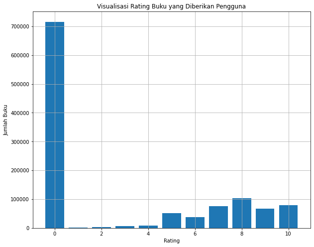
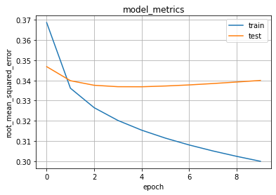

# Laporan Proyek Machine Learning - Fransiskus Ricardo

## Project Overview
Buku adalah jendela dunia dan juga sumber informasi yang sangat luas untuk menambah pengetahuan. Pada era digital buku tidak hanya dalam bentuk fisik, tapi ada juga dalam bentuk buku elektronik. Kemudahan ini tidak membuat tingkat membaca indonesia meningkat. Faktanya, UNESCO menyatakan minat baca buku masyarakat indonesia sanagat rendah, hanya 0,001%. Artinya, dari 1,000 orang Indonesia, cuma 1 orang yang rajin membaca [Kominfo RI](https://www.kominfo.go.id/content/detail/10862/teknologi-masyarakat-indonesia-malas-baca-tapi-cerewet-di-medsos/0/sorotan_media). 

Hal tersebut sangat disayangkan.Oleh sebab itu penulis membuat sistem rekomendasi buku menggunakan Machine yaitu menggunakan Collaborative Filtering.

### Problem Statement
Berdasarkan latar belakang yang telah dipaparkan, berikut rincian masalah yang akan disolusikan pada proyek ini:
- Bagaimana cara membuat sistem rekomendasi berdasarkan kemiripan buku untuk dibaca user menggunakan metode Collaborative Filtering ?

### Goals
Berdasarkan *problem statement* diatas, berikut tujuan dari proyek ini:

- Membuat sistem rekomendasi buku kepada user berdasarkan rating buku yang telah diberikan sebelumnya dengan metode Collaborative Filtering.

### Solution statements
Solusi yang akan diterapkan pada projek ini adalah menggunakan metode [Collaborative Filtering](https://developers.google.com/machine-learning/recommendation/collaborative/basics).

## Data Understanding
Dataset yang digunakan untuk membuat sistem rekomendasi buku yang diambil dari platform kaggle.com yang dipublikasikan oleh MÖBIUS. Dataset ini terdiri dari 3 file csv yaitu Books.csv, Ratings.csv, dan Users.csv.

Informasi Dataset:

Jenis | Keterangan
--- | ---
Title | Book Recommendation Dataset
Source | [Kaggle](https://www.kaggle.com/arashnic/book-recommendation-dataset)
License | [CC0: Public Domain](https://creativecommons.org/publicdomain/zero/1.0/)

### Books.csv
Pada berkas Books.csv memuat data-data buku sebagai berikut 
|index|ISBN|Book-Title|Book-Author|Year-Of-Publication|Publisher|Image-URL-S|Image-URL-M|Image-URL-L|
|---|---|---|---|---|---|---|---|---|
|0|0195153448|Classical Mythology|Mark P\. O\. Morford|2002|Oxford University Press|http://images\.amazon\.com/images/P/0195153448\.01\.THUMBZZZ\.jpg|http://images\.amazon\.com/images/P/0195153448\.01\.MZZZZZZZ\.jpg|http://images\.amazon\.com/images/P/0195153448\.01\.LZZZZZZZ\.jpg|
|1|0002005018|Clara Callan|Richard Bruce Wright|2001|HarperFlamingo Canada|http://images\.amazon\.com/images/P/0002005018\.01\.THUMBZZZ\.jpg|http://images\.amazon\.com/images/P/0002005018\.01\.MZZZZZZZ\.jpg|http://images\.amazon\.com/images/P/0002005018\.01\.LZZZZZZZ\.jpg|
|2|0060973129|Decision in Normandy|Carlo D'Este|1991|HarperPerennial|http://images\.amazon\.com/images/P/0060973129\.01\.THUMBZZZ\.jpg|http://images\.amazon\.com/images/P/0060973129\.01\.MZZZZZZZ\.jpg|http://images\.amazon\.com/images/P/0060973129\.01\.LZZZZZZZ\.jpg|
|3|0374157065|Flu: The Story of the Great Influenza Pandemic of 1918 and the Search for the Virus That Caused It|Gina Bari Kolata|1999|Farrar Straus Giroux|http://images\.amazon\.com/images/P/0374157065\.01\.THUMBZZZ\.jpg|http://images\.amazon\.com/images/P/0374157065\.01\.MZZZZZZZ\.jpg|http://images\.amazon\.com/images/P/0374157065\.01\.LZZZZZZZ\.jpg|
|4|0393045218|The Mummies of Urumchi|E\. J\. W\. Barber|1999|W\. W\. Norton &amp; Company|http://images\.amazon\.com/images/P/0393045218\.01\.THUMBZZZ\.jpg|http://images\.amazon\.com/images/P/0393045218\.01\.MZZZZZZZ\.jpg|http://images\.amazon\.com/images/P/0393045218\.01\.LZZZZZZZ\.jpg|

 

Pada dataset Books.csv terdapat 271360 baris dan 8 kolom. Pada kolom berisi data Book-Title, Book-Author, Year-Of-Publication, Publisher, Image-URL-S, Image-URL-M, Image-URL-L.

Informasi data Books.csv :

Attribute  | Keterangan
------------- | -------------
ISBN | Kode ISBN dari Buku
Book-Title | Judul Buku
Book-Author | Nama Penulis buku
Year-Of-Publication | Tahun Terbit Buku
Publisher | Nama Penerbit Buku
Image-URL-S | URL Menuju Gambar Buku Berukuran Kecil
Image-URL-M | URL Menuju Gambar Buku Berukuran Sedang
Image-URL-L | URL menuju Gambar Buku Berukuran Besar

   

### Ratings.csv 
Pada berkas Ratings.csv memuat data-data buku sebagai berikut 

User-ID |	ISBN | Book-Rating
|index|User-ID|ISBN|Book-Rating|user|book|
|---|---|---|---|---|---|
|0|276725|034545104X|0\.0|0|0|
|1|276726|0155061224|5\.0|1|1|
|2|276727|0446520802|0\.0|2|2|
|3|276729|052165615X|3\.0|3|3|
|4|276729|0521795028|6\.0|3|4|

 

Selanjutnya, menghitung Jumlah buku pada setiap reting.
|Book-Rating|User-ID|ISBN|
|---|---|---|
|0|716109|716109|
|1|1770|1770|
|2|2759|2759|
|3|5996|5996|
|4|8904|8904|
|5|50974|50974|
|6|36924|36924|
|7|76457|76457|
|8|103736|103736|
|9|67541|67541|
|10|78610|78610|
 
  

Selanjutnya akan mengecek distribusi rating pada Ratings.csv, menggunakan fungsi **describe()**.
|index|User-ID|Book-Rating|
|---|---|---|
|count|1149780\.000000|1149780\.000000|
|mean|140386\.395126|2\.866950|
|std|80562\.277719|3\.854184|
|min|2\.000000|0\.000000|
|25%|70345\.000000|0\.000000|
|50%|141010\.000000|0\.000000|
|75%|211028\.000000|7\.000000|
|max|278854\.000000|10\.000000|

 

Selanjutnya, akan di visualisasikan jumlah rating yang diberikan oleh user.  
  
Pada visualisasi diagram diperoleh bahwa rating yang diberikan dari 0 sampai 10 dan mayoritas user memberikan rating 0 pada buku, sehingga data tersebut tidak seimbang (imbalance). 
 

Pada dataset Ratings.csv terdapat 1149780 baris dan 3 kolom. Pada kolom berisi data ISBN, Book-Rating.
Informasi data Ratings.csv :

Attribute  | Keterangan
------------- | -------------
User-ID | ID Pengguna
ISBN | Kode ISBN dari Buku
Book-Rating | Rating Buku 

   

### Users.csv.
Berikut akan memuat isi file Users.csv.
|index|User-ID|Location|Age|
|---|---|---|---|
|0|1|nyc, new york, usa|NaN|
|1|2|stockton, california, usa|18\.0|
|2|3|moscow, yukon territory, russia|NaN|
|3|4|porto, v\.n\.gaia, portugal|17\.0|
|4|5|farnborough, hants, united kingdom|NaN|

 

Pada dataset Users.csv terdapat 278858 baris dan 3 kolom. Pada kolom berisi data User-ID, Location, Age .
Informasi data Users.csv :

Attribute  | Keterangan
------------- | -------------
User-ID | ID Pengguna
Location | Lokasi Pengguna
Age | Usia Pengguna

   

## Data Preparation
Teknik yang digunakan dalam penyiapan data *(Data Preparation)* yaitu:
- **Encoding** : Melakukan Encoding  `User-ID` dan `ISBN` ke dalam indeks integer. Tahapan ini diperlukan karena kedua data tersebut berisi integer yang tidak berurutan (acak) dan gabungan string. Untuk itu perlu diubah ke dalam bentuk indeks.
- **Membagi Data Untuk Training Dan Validasi** :Sebelum melakukan pembagian, data terlebih dahulu diacak agar distribusi datanya menjadi random. Pengacakan data bertujuan untuk mengurangi varians dan memastikan bahwa model tetap umum dan *overfit less*. Pengacakan data juga memastikan bahwa data yang digunakan saat validasi merepresentasikan seluruh distribusi data yang ada. Selanjutnya dataset dibagi menjadi 2 bagian, yaitu data yang akan digunakan untuk melatih model sebanyak 80% dan data untuk memvalidasi model sebanyak 20%. Tujuannya untuk proses melatih model dan mengukur kinerja model.

   

## Modeling
Pada tahap ini, model melakukan perhitung skor kecocokan antara user dan buku dengan teknik embedding. 

Pada kelas RecommenderNet diberikan parameter pada layer embedding antara lain:
- `num_users` : jumlah data pengguna
- `num_isbn` : jumlah data buku, dihitung berdasarkan ISBN
- `embedding_size` : ukuran atau dimensi yang digunakan dalam embedding pada data user dan buku

Cara kerja Model :
1. Akan dilakukan proses embedding terhadap data user dan buku. Jumlah user dan buku yang didefinisikan pada `num_users` dan `num_isbn` bertujuan sebagai input untuk membuat vektor embedding keduanya. Sedangkan `embedding_size` menentukan ukuran atau dimensi embedding yang dibuat. Semakin besar nilai dari `embedding_size` akan membuat model semakin akurat, namun jika berlebihan akan mengakibatkan model menjadi overfit. 
2. Dilakukan operasi perkalian *dot product* antara embedding user dan buku. Selain itu, kita juga dapat menambahkan bias untuk setiap user dan buku. Skor kecocokan ditetapkan dalam skala [0,1] dengan fungsi aktivasi sigmoid.
3. Model di-compile dengan fungsi loss binarycrossentropy, optimizer menggunakan Adam dengan learning rate sebesar 0.001.   

### Rekomendasi yang diberikan model yaitu memberikan rekomendasi top-10 buku kepada user.  
Rekomendasi untuk users: 253106  
===========================   
### Buku dengan peringkat tinggi dari user lain  
--------------------------------  
Harper Lee - To Kill a Mockingbird  
Ann Patchett - Bel Canto: A Novel  
Anita Shreve - The Last Time They Met : A Novel  
Dominick Dunne - The Two Mrs. Grenvilles  
Geoffrey Farrington - The Revenants    
### Top 10 Rekomendasi Buku  
--------------------------------  
DR SEUSS - One Fish Two Fish Red Fish Blue Fish (I Can Read It All by Myself Beginner Books)  
Paul Vincent - Free  
Shel Silverstein - Falling Up  
Neil Gaiman - Death: The High Cost of Living  
Else Holmelund Minarik - A Kiss for Little Bear  
Bill Watterson - There's Treasure Everywhere--A Calvin and Hobbes Collection  
J. K. Rowling - Harry Potter and the Chamber of Secrets Postcard Book  
Bradley Trevor Greive - The Blue Day Book: A Lesson in Cheering Yourself Up  
Berkeley Breathed - Bloom County Babylon : Five Years of Basic Naughtiness (Bloom County)  
DC Talk - Jesus Freaks: DC Talk and The Voice of the Martyrs - Stories of Those Who Stood For Jesus, the Ultimate Jesus Freaks

   

## Evaluation
Pada projek ini menggunakan metrik RMSE (Root Mean Square Error) untuk mengevaluasi kinerja model yang dihasilkan. RMSE adalah cara standar untuk mengukur kesalahan model dalam memprediksi data kuantitatif. Root Mean Squared Error (RMSE) mengevaluasi model regresi linear dengan mengukur tingkat akurasi hasil perkiraan suatu model. 

Selanjutnya akan diplot metrik RMSE pelatihan model.  

 
Pada hasil plot RMSE memiliki skor nilai RMSE sebesar 0.3000, nilai tersebut sudah cukup bagus. 

   

## Referensi

[[1](https://www.kominfo.go.id/content/detail/10862/teknologi-masyarakat-indonesia-malas-baca-tapi-cerewet-di-medsos/0/sorotan_media)] Devega, Evita . (2017). *TEKNOLOGI Masyarakat Indonesia: Malas Baca Tapi Cerewet di Medsos*. KOMINFO. https://www.kominfo.go.id/content/detail/10862/teknologi-masyarakat-indonesia-malas-baca-tapi-cerewet-di-medsos/0/sorotan_media

[[2](https://towardsdatascience.com/what-does-rmse-really-mean-806b65f2e48e)] Moody, J. (2019). *What does RMSE really mean?*. Towards Data Science. https://towardsdatascience.com/what-does-rmse-really-mean-806b65f2e48e

